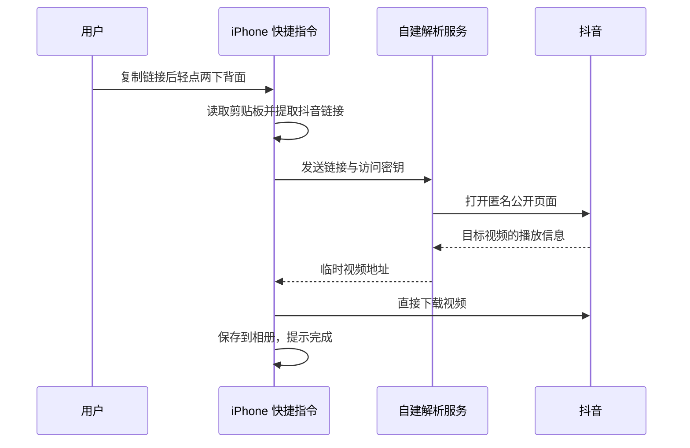

# 轻点下载 · Back Tap Douyin

复制抖音视频链接，轻点两下 iPhone 背面，将视频保存到相册。

这是一个 **自建解析服务 + iOS 快捷指令** 的开源项目。**不附带公共解析服务；下载快捷指令后，必须填写可用的服务地址和密钥。** GitHub 负责托管源码和安装包，不会替你运行后端。

[用户安装教程](docs/INSTALL.md) · [自建服务教程](docs/DEPLOY.md) · [下载快捷指令](https://github.com/Hype-yolo/backtap-douyin/releases/tag/v0.1.0) · [测试范围](docs/VALIDATION.md)

## 谁需要做什么

| 你的角色 | 要做的事 |
| --- | --- |
| 普通用户 | 从服务管理员取得地址和密钥 → 添加快捷指令 → 填写两项设置 → 绑定轻点背面 |
| 服务管理员 | 在自己的 Linux 服务器部署一次后端 → 配置 HTTPS → 提供地址和访问密钥 |
| 开发者 | 修改 Node.js 后端或 Python 快捷指令生成器，运行测试并自行签名 |

管理员部署完成后，普通用户不用安装开发工具，也不用开电脑。

## 工作方式



服务使用独立的匿名 Chromium 获取页面正常返回的视频详情，核对作品 ID，再关闭页面。不导入个人浏览器资料、Cookie，不处理登录、验证码或非公开作品。视频文件由手机直接下载，不经本服务中转。

## 功能与边界

- 支持复制出来的抖音分享文字、短链接和单条视频链接。
- 剪贴板只在用户运行快捷指令时读取；只发送匹配到的链接，不发送整段剪贴板文字。
- 优先选择 H.264 播放源；清晰度取决于平台返回的信息，不承诺固定画质或去水印。
- 提供访问密钥、单请求并发限制、短时缓存、请求限流；可选公共模式带持久化每日额度。
- **目前是实验性版本**。已验证云端解析、跨网络下载和 Mac 快捷指令动作导入；iPhone 上“轻点背面 → 相册”的完整流程尚未实机验收。
- 单次云端样本解析约 32 秒，资源峰值约 421 MiB；不适合直接无限量开放到小内存共享服务器。平台变更或限制会导致失败。
- 图集、直播、批量下载、登录后可见内容不在首版范围内。

## 本地开发

需要 Node.js 20.20+（或更新的受支持版本）、Python 3；完整下载验证还需要 ffprobe。

```bash
npm ci
npx playwright install chromium --only-shell
cp .env.example .env
openssl rand -hex 24
```

将生成的随机值填入 `.env` 的 `API_TOKEN`，然后：

```bash
npm test
npm start
```

健康检查：`http://127.0.0.1:8796/health`。健康检查仅证明进程工作，不代表抖音解析可用。真实链路验证见[部署教程](docs/DEPLOY.md)。

生成快捷指令（需 macOS 才能签名）：

```bash
python3 scripts/build_shortcut.py
shortcuts sign --mode anyone \
  --input shortcuts/轻点下载.unsigned.shortcut \
  --output shortcuts/backtap-douyin.shortcut
```

生成器源码和 `shortcuts/workflow.json` 可审查。不要发布填有个人服务密钥的安装包。

## API

`GET /v1/resolve?url=<URL编码的抖音链接>` 或 `POST /v1/resolve`，JSON 请求体为 `{"url":"抖音链接"}`。默认需要 `Authorization: Bearer <API_TOKEN>`。

成功：

```json
{"ok":true,"id":"作品ID","title":"标题","video_url":"https://视频CDN/临时地址","filename":"douyin-作品ID.mp4","duration":33.734,"width":1080,"height":1920}
```

失败：`{"ok":false,"error":{"code":"RESOLVE_FAILED","message":"失败原因"},"request_id":"请求编号"}`，并使用相应 HTTP 状态码。视频地址有时效，取得后应立即下载。

## 许可证

原创项目代码采用 [MIT](LICENSE)。对标指令、第三方解析服务与视频内容不包含在本项目许可证中；本项目没有复制对标指令的 token，也不使用其解析接口。请只保存自己有权下载和使用的内容。
